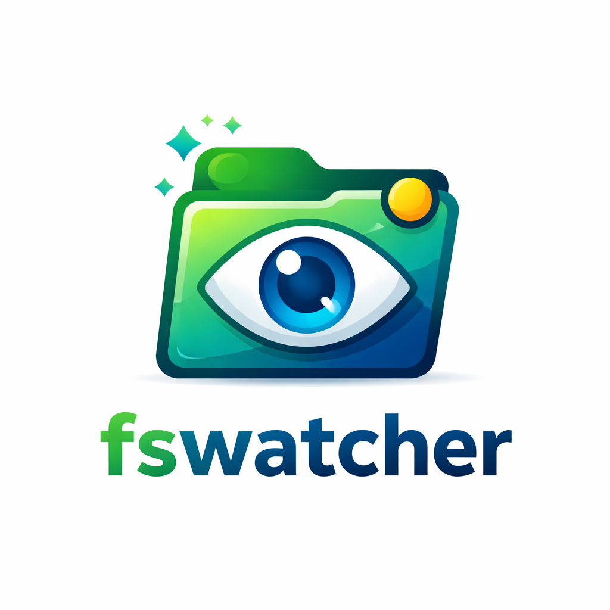

# fswatcher for GameMaker



A modern, high-performance file system watcher DLL for GameMaker. It allows you to monitor directory changes in real-time, which is essential for tools like external editors, asset reloaders, or engine integrations.

Built with **C++ 17** and optimized for **Visual Studio 2022**, it provides a clean asynchronous interface to track creation, deletion, modification, and renaming of files.

## Features

- **Real-time Monitoring**: Uses Windows overlapped I/O for efficient, non-blocking file system events.
- **Asynchronous Queue**: Events are collected in a background thread and polled when your game is ready.
- **Debouncing Logic**: Built-in protection against duplicate events (common when saving files from certain editors).
- **Lightweight**: Zero external dependencies beyond the Windows API.
- **Easy Integration**: Simple string-based protocol for GameMaker.

## API Reference

### `fswatcher_start(path)`
Starts monitoring the specified absolute path.
- **Arguments**: `path` (String) - The absolute path to the directory.
- **Returns**: `1.0` on success, `0.0` on failure.

### `fswatcher_poll()`
Retrieves the next event from the queue.
- **Returns**: A string representing the event, or an empty string `""` if no events are pending.
- **Event Formats**:
  - `CREATED|path`
  - `DELETED|path`
  - `MODIFIED|path`
  - `RENAMED|oldpath|newpath`

### `fswatcher_stop()`
Stops the monitoring thread and cleans up resources.
- **Returns**: `1.0` on success.

### `fswatcher_onchange(callback)`
A GML wrapper function that simplifies event handling.
- **Arguments**: `callback` (Function) - A function that receives `(event, path, [newPath])`.

## Usage Example (GML)

In your **Create Event**:
```gml
// Start watching a specific directory
var target_path = "C:\\MyProject\\Assets";
if (fswatcher_start(target_path)) {
    show_debug_message("FSWatcher started on: " + target_path);
}
```

In your **Step Event**:
```gml
// Using the convenient wrapper
fswatcher_onchange(function(event, path, newPath) {
    if (event == "RENAMED") {
        show_debug_message("RENAMED: " + path + " -> " + newPath);
    } else {
        show_debug_message(event + ": " + path);
    }
});

/* 
// Or manual polling if you prefer
var event = fswatcher_poll();
while (event != "") {
    var data = string_split(event, "|");
    var type = data[0];
    
    switch (type) {
        case "CREATED":
        case "DELETED":
        case "MODIFIED":
            var file_path = data[1];
            show_debug_message(type + ": " + file_path);
            break;
            
        case "RENAMED":
            var old_path = data[1];
            var new_path = data[2];
            show_debug_message("RENAMED: " + old_path + " -> " + new_path);
            break;
    }
    
    // Poll next event in the same frame
    event = fswatcher_poll();
}
*/
```

In your **Clean Up / Game End Event**:
```gml
fswatcher_stop();
```

## Installation

### Method 1: Importing the Extension
1. Download the `fswatcher.yymps` (if available) or the source repository.
2. In GameMaker, right-click on **Extensions** in the Asset Browser.
3. Select **Import Local Package**.
4. Choose the `fswatcher.yymps` file and import all resources.

### Method 2: Manual Installation
1. Create a new Extension in your GameMaker project named `fswatcher`.
2. Right-click the extension and select **Add File**, then choose `fswatcher.dll`.
3. Add the following functions to the DLL file in the extension editor:
   - `fswatcher_start` (External Name: `fswatcher_start`, Arguments: `String`, Return: `Double`)
   - `fswatcher_poll` (External Name: `fswatcher_poll`, Arguments: `None`, Return: `String`)
   - `fswatcher_stop` (External Name: `fswatcher_stop`, Arguments: `None`, Return: `Double`)

## Building from Source

To compile the DLL yourself:
1. Open `source/fswatcher/fswatcher.sln` in **Visual Studio 2022**.
2. Set the configuration to **Release** and platform to **x64**.
3. Build the solution (**Ctrl+Shift+B**).
4. The compiled DLL will be located in `source/fswatcher/x64/Release/fswatcher.dll`.

## Requirements
- **OS**: Windows (Uses Win32 API)
- **Compiler**: MSVC with C++17 support
- **GameMaker**: Works with modern LTS and Monthly versions.

## License
MIT License. Feel free to use it in any project.
